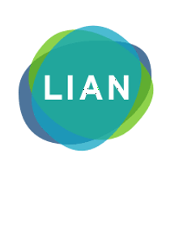
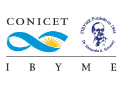

## Hi there, I'm Ale 👋

 
 

### now I'm listening

<!--
**alelagreca/alelagreca** is a ✨ _special_ ✨ repository because its `README.md` (this file) appears on your GitHub profile.

Here are some ideas to get you started:

- 🔭 I’m currently working on ...
- 🌱 I’m currently learning ...
- 👯 I’m looking to collaborate on ...
- 🤔 I’m looking for help with ...
- 💬 Ask me about ...
- 📫 How to reach me: ...
- 😄 Pronouns: ...
- ⚡ Fun fact: ...
-->
 
 

### **currently using and continuously learning**
[][python]
[][sql]
[][rbase]
[][bash]
[][nextflow]
[][git]
[][vscode]
[][github]
[][databricks]

 
 

### **get in touch with me**
[][zs] 
[][twitter]
[][linkedin]
[][f6]

 
 

### **a few words about me**
---
I got my BSc degree in molecular biology at the University of Buenos Aires. Being an undergraduate I began my scientific career studying hormone-dependent gene regulation in endometrial adenocarcinoma cells. Then, I went on to obtain my PhD on the regulatory mechanisms of nuclear steroid receptors and chromosome architecture using the same in vitro model. During this time, I gained experience in NGS technologies, bioinformatic analyses and programming, which I then applied into Stem Cell Biology & Cardiac differentiation projects as a Postdoctoral Fellow, mostly focused on non-coding RNAs. After co-developing a variety of AI projects, I participated in the creation of a healthcare startup dedicated to the early AI-based diagnosis of cardiovascular disease using whole blood transcriptome, where I led a team of bioinformaticians and data scientists. Currently, I'm part of ZS as an Senior Bioinformatician-Associate Consultant, assisting clients to achieve their objectives.

<!--
[][lian]
[][fleni]
[][conicet]
[][ibyme]
[][crg]

-->

 
 

---

 
 

<!-- ##Uncomment to show commit score##

-->

<!--
Definitions
-->
[vscode]: https://code.visualstudio.com/
[python]: https://www.python.org/
[rbase]: https://www.r-project.org/
[git]: https://git-scm.com
[github]: https://github.com
[bash]: https://www.gnu.org/software/bash/
[twitter]: https://twitter.com/aled_lg
[linkedin]: https://linkedin.com/in/alejandro-la-greca-394aa955
[f6]: https://www.f6s.com/alejandrolagreca
[multiplai]: https://www.multiplaihealth.com/
[gmail]: ale.lagreca@gmail.com
[gmail2]: alejandro.lagreca@multiplaihealth.com
[lian]: https://www.fleni.org.ar/lian/
[fleni]: https://www.fleni.org.ar
[ibyme]: https://www.ibyme.org.ar/
[conicet]: https://www.conicet.gov.ar/
[gmailzs]: alejandro.lagreca@zs.com
[zs]: https://www.zs.com/
[nextflow]: https://www.nextflow.io/
[databricks]: https://www.databricks.com/
[sql]: https://www.mysql.com/
